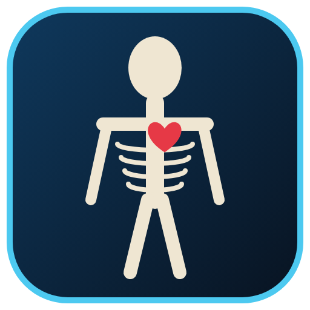

# Human Anatomy 3D – التشريح ثلاثي الأبعاد

برنامج ويندوز تفاعلي لاستكشاف جسم الإنسان كاملاً بالأبعاد الثلاثية، بواجهة عربية ويعمل دون اتصال بالإنترنت.



## المزايا

- **181 جزءاً تشريحياً** موزعة على 10 أجهزة:
  - الجلد
  - الجهاز الهيكلي: الجمجمة، والفك، والفقرات الـ24 كل واحدة منفصلة، والأضلاع، والحوض، وعظام الأطراف واليدين والقدمين
  - الجهاز العضلي
  - الجهاز العصبي: الدماغ، والمخيخ، والحبل الشوكي، والأعصاب الطرفية
  - الجهاز الدوري: القلب، والشرايين، والأوردة
  - الجهاز التنفسي
  - الجهاز الهضمي
  - الجهاز البولي
  - الغدد الصماء
  - أعضاء الحس
- **لكل جزء** اسمه بالعربية والإنجليزية ووصف علمي مختصر لوظيفته.
- **إظهار وإخفاء** كل جهاز، مع التحكم في شفافيته.
- **النقر على أي عضو** لتحديده وعرض معلوماته، مع خيارات للتركيز عليه أو عزله أو إخفائه، والتراجع بـ Ctrl+Z.
- **البحث الفوري** بالعربية أو الإنجليزية.
- **وضع الأشعة** لرؤية الأعضاء عبر الجلد والعضلات.
- **تفكيك الأجزاء** لإبعادها عن بعضها ورؤيتها منفصلة.
- **التسميات التلقائية** على الأجزاء الظاهرة في الشاشة.
- **وضع الاختبار** لتعلّم أسماء الأعضاء بأسئلة اختيار من متعدد.
- **زوايا عرض جاهزة** ودوران تلقائي وحفظ لقطة شاشة PNG.

## التحميل

كل دفعة (push) إلى المستودع تشغّل GitHub Actions، فيبني البرنامج على ويندوز. لتحميله:

1. افتح تبويب **Actions** في المستودع، ثم اختر آخر تشغيل ناجح لـ **Build Windows EXE**.
2. حمّل الملف المرفق **HumanAnatomy3D-windows**، وستجد بداخله:
   - `HumanAnatomy3D-<version>-portable.exe`: نسخة محمولة تعمل مباشرة دون تثبيت.
   - `HumanAnatomy3D-<version>-setup.exe`: مثبّت عادي ينشئ اختصاراً في قائمة ابدأ.

وعند دفع وسم (tag) مثل `v1.0.0` ينشر سير العمل الملفين تلقائياً في صفحة **Releases**.

> البرنامج غير موقّع رقمياً، لذا قد يظهر تحذير Windows SmartScreen عند أول تشغيل. لتجاوزه اضغط «مزيد من المعلومات» ثم «تشغيل على أي حال».

## التشغيل من المصدر

```bash
npm install
npm start          # تشغيل البرنامج في وضع التطوير
npm run dist       # بناء ملفات exe في مجلد dist (يتطلب ويندوز لبناء المثبّت)
npm run dist:dir   # بناء نسخة غير مضغوطة في dist/win-unpacked
```

## اختصارات لوحة المفاتيح

| المفتاح | الوظيفة |
|---|---|
| سحب بالزر الأيسر / الأيمن / العجلة | تدوير / تحريك / تكبير |
| نقرة / نقرة مزدوجة | تحديد / تركيز |
| Alt + نقرة | إخفاء الجزء |
| 1-5 | أمامي، خلفي، أيسر، أيمن، علوي |
| R / A / X / L | إعادة الضبط / إظهار الكل / أشعة / تسميات |
| Delete / I / F | إخفاء / عزل / تركيز على المحدد |
| Ctrl+F / Ctrl+Z | بحث / تراجع |
| Q / P / Space / F11 | اختبار / صورة / دوران / ملء الشاشة |

## البنية التقنية

- **Electron** لتغليف البرنامج كتطبيق سطح مكتب لويندوز، و**Three.js** للرسم ثلاثي الأبعاد.
- كل النماذج تُولَّد برمجياً عند التشغيل، فلا توجد ملفات نماذج خارجية:
  - `src/js/sdf.js`: حقول المسافة الموقّعة (SDF) مع خوارزمية Surface Nets، لتوليد أسطح عضوية ناعمة كالجلد والجمجمة والحوض والرئتين والكبد، مع إضاءة محيطية مخبوزة.
  - `src/js/geo.js`: أنابيب متغيرة القطر وبطون عضلية وعظام طويلة.
  - `src/js/anatomy.js`: تعريف كل الأجزاء وإحداثياتها ونصوصها.
  - `src/js/app.js`: الواجهة والتفاعل، أي التحديد والبحث والتسميات والاختبار.

النموذج تعليمي مبسّط وليس بديلاً عن المراجع الطبية المتخصصة.
